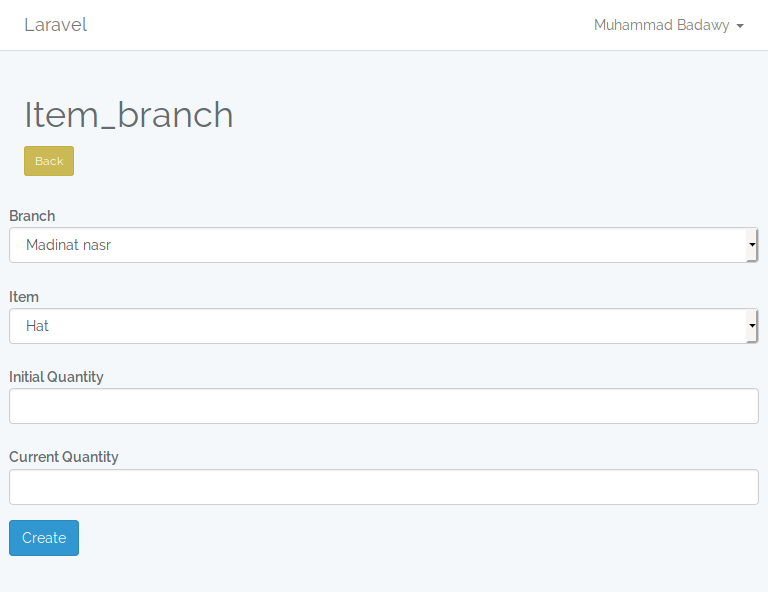

Store Management using repository_design_pattern
===

This system consists of :

- Users
- Branches
- Emplyees
- Items
- Categores
- Storage (item and branch)
- Transactions (item transaction at a branch)

The system uses the repository design pattern to help manage the transactions of the system and updating the quantities of the products.

And To manage viewing the available and unavailable categories.

Then viewing lists of 1 to many relationships using the repository design pattern.

And automating creating storages (empty) of items whenever the item added to the system

Handling the change of quantities of items in the branches and storeges using the repository

Admin panel

An example of a CRUD

Create

Show

